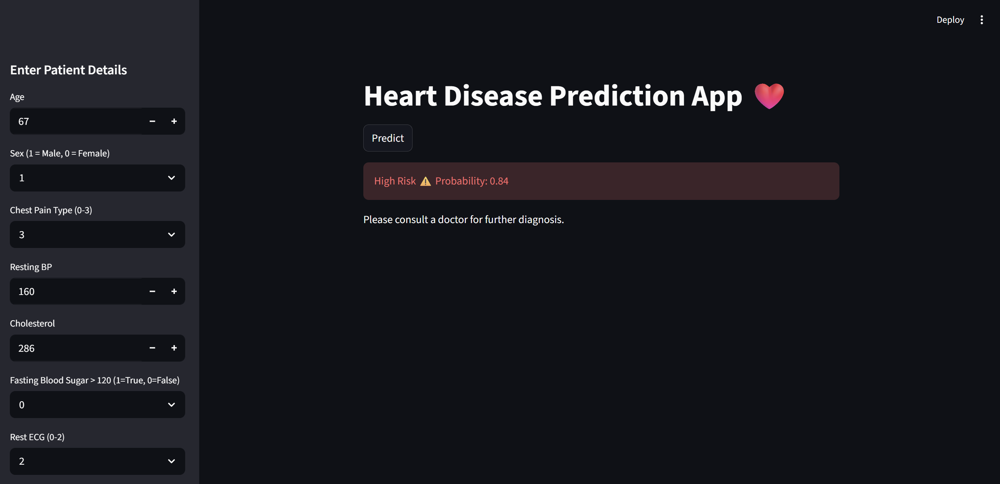

# ❤️ Heart Disease Prediction App

## Project Overview
This project is a Machine Learning-based web application that predicts the risk of heart disease based on patient health parameters. The model is trained using clinical data and deployed using Streamlit.

## 🚀 Live Demo
👉 https://heart-disease-prediction-rqlxvdos6v4ajygh2mgyfn.streamlit.app/

## 📊 Dataset
- Source: UCI Heart Disease Dataset  
- File used: `processed.cleveland.data`  
- Contains patient health attributes like age, cholesterol, blood pressure, etc.

## 🧠 Models Used
- Logistic Regression  
- Random Forest Classifier  

## 📈 Model Performance
- Accuracy: ~88%  
- ROC-AUC Score: ~0.94  

## 🔍 Key Insights
- Maximum heart rate (thalach) is the most important feature  
- Number of major vessels (ca) and thalassemia (thal) are highly influential  
- Chest pain type and oldpeak strongly impact predictions  
- ROC-AUC was prioritized due to importance of minimizing false negatives in healthcare  

## 🛠️ Tech Stack
- Python  
- Pandas, NumPy  
- Scikit-learn  
- Streamlit  

## 📸 App Screenshot

